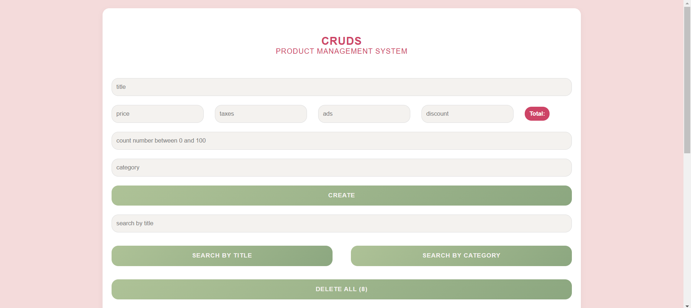
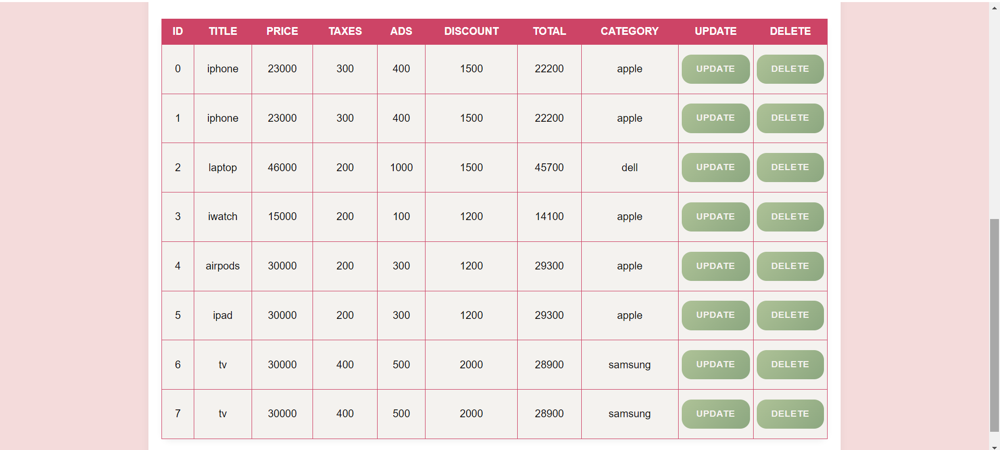

<<<<<<< HEAD
Product Management System (CRUD)
This is a simple Product Management System built using HTML, CSS, and JavaScript. The application allows users to Create, Read, Update, and Delete (CRUD) products, as well as search for products by title or category. The project is designed with a soft, girly aesthetic to create a pleasant user experience.

Features
Create Products: Add new products with details such as title, price, taxes, ads, discount, count, and category.
Calculate Total: Automatically calculate the total price after considering taxes, ads, and discounts.
Read Products: View all added products in a table with sortable columns.
Update Products: Modify existing product details.
Delete Products: Remove individual products or delete all products at once.
Search Products: Search products by title or category.
Data Persistence: All product data is stored in the browser's local storage, so it remains intact even after refreshing the page.
Technologies Used
HTML: For structuring the web page.
CSS: For styling the web page with a girly and soft theme.
JavaScript: For adding interactivity and handling CRUD operations.
Project Structure
cruds.html: The main HTML file that contains the structure of the application.
cruds.css: The CSS file for styling the application with a soft, girly theme.
cruds.js: The JavaScript file that handles the CRUD operations and dynamic interactions.
README.md: This file, providing an overview of the project.
How to Use
Clone the repository:
bash
Copy code
git clone https://github.com/ruu23/CRUDS.git
Open the project:
Open cruds.html in your web browser to view the application.
Add, Update, or Delete Products:
Use the form to add new products.
View and manage products in the table below the form.
Demo
Here's a quick look at the Product Management System:


Contributing
If you'd like to contribute to this project, feel free to fork the repository and submit a pull request.

License
This project is licensed under the MIT License. See the LICENSE file for more details.

=======
Certainly! Here's an enhanced version of the `README.md` file, with a more polished and professional style:

---

# **Product Management System (CRUD)**

Welcome to the **Product Management System**, a sleek and user-friendly application designed to manage your products effortlessly. This project leverages **HTML**, **CSS**, and **JavaScript** to deliver a smooth experience for managing product data, all with a soft, girly aesthetic.

## **✨ Features**

- **Create Products:** Seamlessly add new products with details like title, price, taxes, ads, discounts, count, and category.
- **Calculate Total:** Automatically compute the total price, factoring in taxes, ads, and discounts.
- **Read Products:** View all added products in a beautifully organized table with sortable columns.
- **Update Products:** Easily modify existing product details to keep your data up-to-date.
- **Delete Products:** Remove individual products or clear all entries at once with a single click.
- **Search Products:** Quickly find products by title or category using the search functionality.
- **Data Persistence:** Product data is stored locally in the browser, ensuring it remains available even after page refreshes.

## **🔧 Technologies Used**

- **HTML:** Provides the structural backbone of the web page.
- **CSS:** Styles the application with a soft, feminine touch to create a pleasing visual experience.
- **JavaScript:** Powers the interactivity and CRUD operations, making the application dynamic and responsive.

## **📁 Project Structure**

- **`cruds.html`:** The main HTML file that defines the application's structure.
- **`cruds.css`:** The CSS file responsible for styling the application with a soft, girly theme.
- **`cruds.js`:** The JavaScript file that handles all CRUD operations and dynamic interactions.
- **`README.md`:** This file, offering a comprehensive overview of the project.

## **🚀 How to Use**

1. **Clone the Repository:**
   ```bash
   git clone https://github.com/ruu23/CRUDS.git
   ```
2. **Open the Project:**
   - Open `cruds.html` in your preferred web browser to launch the application.
3. **Manage Your Products:**
   - Use the form to add new products.
   - View, update, or delete products directly from the table below the form.

## **🎨 Demo**

Get a glimpse of the Product Management System in action:




## **🤝 Contributing**

We welcome contributions! If you have ideas or improvements, feel free to fork this repository and submit a pull request.

## **📄 License**

This project is licensed under the MIT License. See the [LICENSE](LICENSE) file for full details.
>>>>>>> 119e5af8dbb3d71bde53c913520f1aacf832a098
