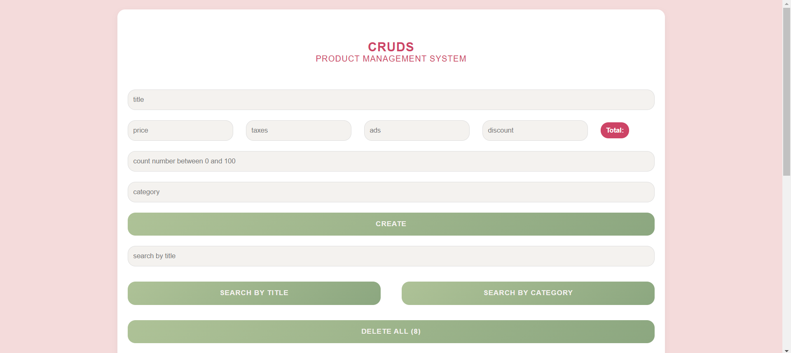
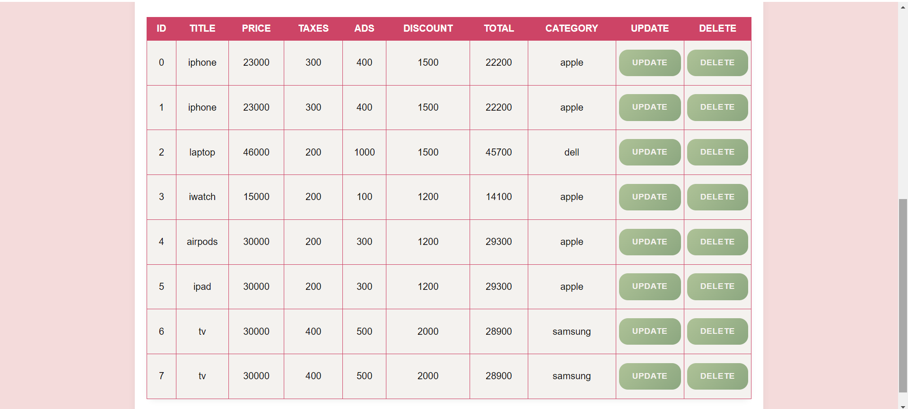

# **Product Management System (CRUD)**

Welcome to the **Product Management System**, a sleek and user-friendly application designed to manage your products effortlessly. This project leverages **HTML**, **CSS**, and **JavaScript** to deliver a smooth experience for managing product data, all with a soft, girly aesthetic.

## **✨ Features**

- **Create Products:** Seamlessly add new products with details like title, price, taxes, ads, discounts, count, and category.
- **Calculate Total:** Automatically compute the total price, factoring in taxes, ads, and discounts.
- **Read Products:** View all added products in a beautifully organized table with sortable columns.
- **Update Products:** Easily modify existing product details to keep your data up-to-date.
- **Delete Products:** Remove individual products or clear all entries at once with a single click.
- **Search Products:** Quickly find products by title or category using the search functionality.
- **Data Persistence:** Product data is stored locally in the browser, ensuring it remains available even after page refreshes.

## **🔧 Technologies Used**

- **HTML:** Provides the structural backbone of the web page.
- **CSS:** Styles the application with a soft, feminine touch to create a pleasing visual experience.
- **JavaScript:** Powers the interactivity and CRUD operations, making the application dynamic and responsive.

## **📁 Project Structure**

- **`cruds.html`:** The main HTML file that defines the application's structure.
- **`cruds.css`:** The CSS file responsible for styling the application with a soft, girly theme.
- **`cruds.js`:** The JavaScript file that handles all CRUD operations and dynamic interactions.
- **`README.md`:** This file, offering a comprehensive overview of the project.

## **🚀 How to Use**

1. **Clone the Repository:**
   ```bash
   git clone https://{token}github.com/ruu23/CRUDS.git
   ```
2. **Open the Project:**
   - Open `cruds.html` in your preferred web browser to launch the application.
3. **Manage Your Products:**
   - Use the form to add new products.
   - View, update, or delete products directly from the table below the form.

## **🎨 Demo**

Get a glimpse of the Product Management System in action:




## **🤝 Contributing**

We welcome contributions! If you have ideas or improvements, feel free to fork this repository and submit a pull request.

## **📄 License**

This project is licensed under the MIT License. See the [LICENSE](LICENSE) file for full details.
>>>>>>> 119e5af8dbb3d71bde53c913520f1aacf832a098
